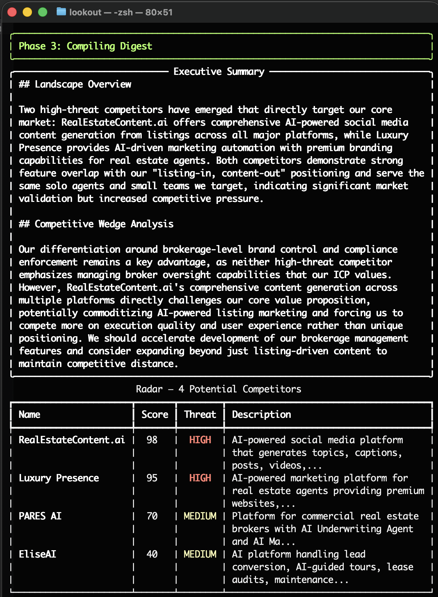
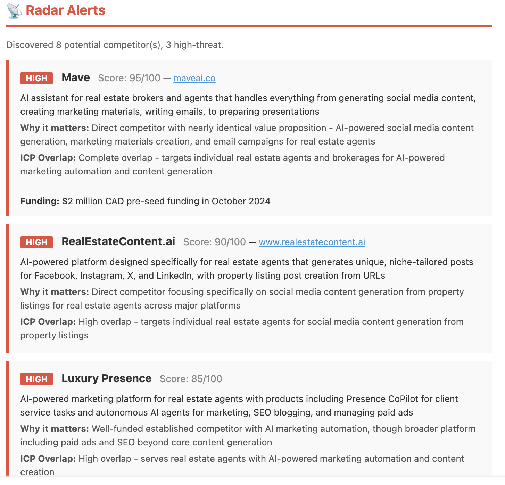
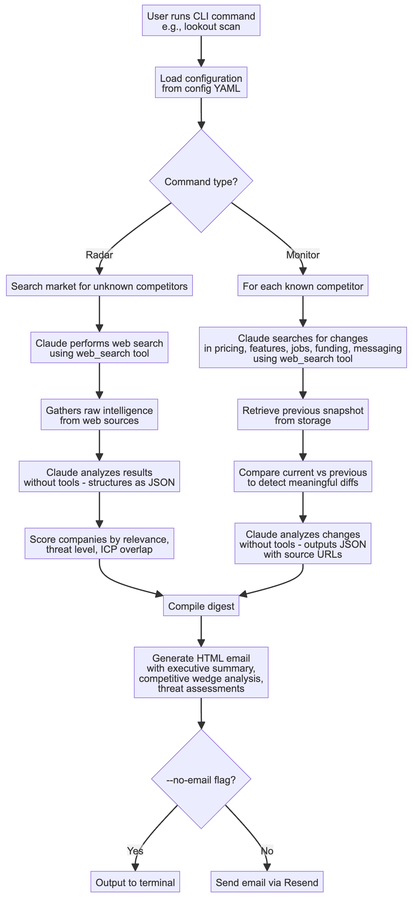

# Lookout

**Competitive intelligence CLI powered by Claude.** Discover competitors you don't know about, track the ones you do, and get email digests with source links.

---

### Why this exists

In early 2026, a real estate marketing startup called VestaList learned that a competitor — Mave AI — had been operating in their exact space for over a year. Mave had raised $7M, onboarded 6,000+ agents, and signed 90+ brokerages. VestaList found out from a friend's Slack message.

Every signal was public. Funding announcements on BusinessWire. Crunchbase profiles. Job postings. Press coverage. Nobody was looking.

Lookout would have caught Mave AI 15 months earlier. The [example config](config/example.yaml) is VestaList's — you can see exactly what a radar alert for Mave would have looked like.

---





## How it works

Lookout uses Claude's web search as its sole data source. No scraping, no browser automation — just Claude searching the web and analyzing what it finds.

**Radar** — Searches your market for companies you might not know about. Scores each by relevance, threat level, and ICP overlap.

**Monitor** — Checks known competitors for changes in pricing, features, hiring, funding, and messaging. Compares against previous snapshots to detect meaningful diffs. Each change includes source URLs so you can dig deeper.

**Digest** — Combines everything into an HTML email with an executive summary, competitive wedge analysis (how findings affect your positioning), threat assessments, and change alerts with clickable sources.

## Quick start

```bash
git clone https://github.com/danwarner/lookout.git
cd lookout
uv sync
```

Set up your API keys:

```bash
cp .env.example .env
# Add your ANTHROPIC_API_KEY (required) and RESEND_API_KEY (for email)
```

Create your config:

```bash
cp config/example.yaml config/mycompany.yaml
# Edit with your company, market, and competitors
```

Try it with the example config (the VestaList case):

```bash
uv run lookout scan -c config/example.yaml --no-email
```

All commands:

```bash
# Full scan — radar + monitor + email digest
uv run lookout scan -c config/mycompany.yaml

# Terminal only, no email
uv run lookout scan -c config/mycompany.yaml --no-email

# Radar only (discover unknown competitors)
uv run lookout radar -c config/mycompany.yaml

# Monitor only (track known competitors)
uv run lookout monitor -c config/mycompany.yaml

# Monitor a single competitor
uv run lookout monitor -c config/mycompany.yaml --competitor "Acme"

# Add a new competitor to your watch list
uv run lookout add -c config/mycompany.yaml "NewCo" "https://newco.com"
```

## Config

See [`config/example.yaml`](config/example.yaml) for a fully annotated example. The key sections:

```yaml
company:
  name: "Your Company"
  description: "What you do"
  competitive_wedge: >          # Optional — enables competitive wedge analysis
    Your differentiation, ICP, and why you win.

market:
  definition: "Your market in one sentence"
  primary_keywords: [...]       # Search terms for radar scans
  negative_keywords: [...]      # Filter out irrelevant results
  icp_overlap_signals: [...]    # How to score ICP fit

competitors:
  - name: "Rival"
    website: "https://rival.com"
    track: [pricing, features, jobs, funding, messaging]
```

When `competitive_wedge` is set, the executive summary includes a **Competitive Wedge Analysis** section — how the findings affect your positioning, whether competitors are encroaching on your ICP, and where your differentiation is holding up or at risk.

## Architecture

Clean architecture with dependency inversion. The domain layer has zero dependencies on external services.

```
domain/          Entities, enums, scoring logic
interfaces/      ABCs — SearchProvider, LLMAnalyzer, EmailSender, SnapshotStore
infrastructure/  Implementations — Anthropic (search + analysis), Resend, file store
use_cases/       Orchestration — radar_scan, monitor_scan, compile_digest
cli/             Click CLI
```



Two-phase pipeline per scan:
1. **Search** — Claude + `web_search` tool gathers raw intelligence
2. **Analysis** — Claude (no tools) structures, scores, and diffs the results as JSON

## Cost

A full scan of 4 competitors runs about $0.30-0.50 in API costs. Web search is ~$0.01 per query.

## Tests

```bash
uv run pytest tests/
```

## Requirements

- Python 3.11+
- [uv](https://docs.astral.sh/uv/) (recommended) or pip
- [Anthropic API key](https://console.anthropic.com/) (required)
- [Resend API key](https://resend.com/) (for email delivery, optional)

## License

MIT
